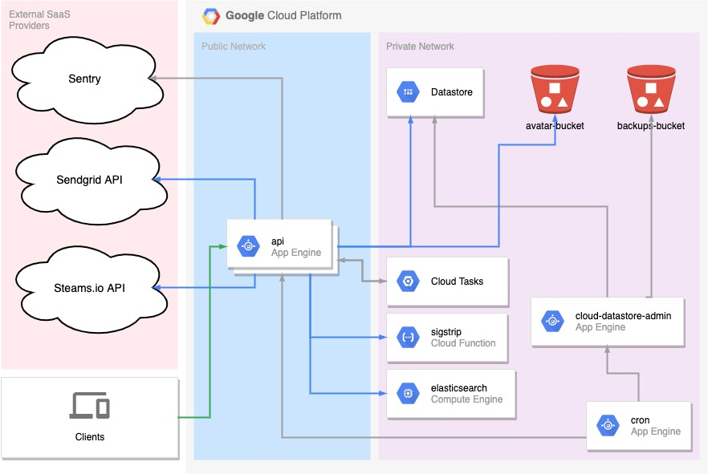

# Convo API

[](https://circleci.com/gh/hiconvo/api) [](https://codecov.io/gh/hiconvo/api) [](https://goreportcard.com/badge/github.com/hiconvo/api)

The repo holds the source code for Convo's RESTful API ([Docs 📑](http://api.hiconvo.com/docs)). Learn more about Convo at [hiconvo.com](https://hiconvo.com). The core technologies and APIs used in the project are:

- [Golang](https://golang.org/)
- [Gorilla](https://www.gorillatoolkit.org/)
- [Google App Engine](https://cloud.google.com/appengine/docs/standard/go112/)
- [Google Datastore](https://godoc.org/cloud.google.com/go/datastore)
- [Sendgrid](https://sendgrid.com/docs/index.html)
- [Elasticsearch](https://www.elastic.co/)
- [Docker](https://docs.docker.com/)

## Development

We use docker based development. In order to run the project locally, you need to create an `.env` file and place it at the root of the project. The `.env` file should contain a Google Maps API key, Sendgrid API key, and a Stream API key and secret. It should look something like this:

```
GOOGLE_MAPS_API_KEY=<YOUR API KEY>
SENDGRID_API_KEY=<YOUR API KEY>
STREAM_API_KEY=<YOUR API KEY>
STREAM_API_SECRET=<YOUR API SECRET>
```

If you don't include this file, the app will panic during startup.

After your `.env` file is ready, all you need to do is run `docker-compose up`. The source code is shared between your machine and the docker container via a volume. The default command runs [`realize`](https://github.com/oxequa/realize), a file watcher that automatically compiles the code and restarts the server when the source changes. By default, the server listens on port `:8080`.

### Running Tests

Run `docker ps` to get the ID of the container running the API. Then run

```
docker exec -it <CONTAINER ID> go test ./...
```

Be mindful that this command will *wipe everything from the database*. There is probably a better way of doing this, but I haven't taken the time to improve this yet.

## Architecture



## Code Overview

The best place to start (after looking at `main/main.go`) is `handlers/router.go`. This is where all endpoints and corresponding functions and middlewares are mounted to a [Gorilla Mux Router](https://github.com/gorilla/mux). Some notable middlewares are `bjson.WithJSON` and `bjson.WithJSONReqBody`. These ensure that all endpoints that they wrap are JSON only and make the decoded request body available in the request context.

The next place to look is `handlers/*.go`. All of the handlers are standard handler functions of the form `func(http.ResponseWriter, *http.Request)`. I decided not to alter this signature with something more app specific since the context at `http.Request.Context()` makes it easy enough to standardize common operations.

The handlers are focused on request validation, getting data from the database, and mutating models - all through higher-level APIs. Some of these operations are complicated, especially the ones concerned with validating users to be included in events or threads, but the separation of concens between models and handlers, though admittedly smelly, is decent enough for now.

The core business logic is in the models. Most of these files are pretty self explanatory.
